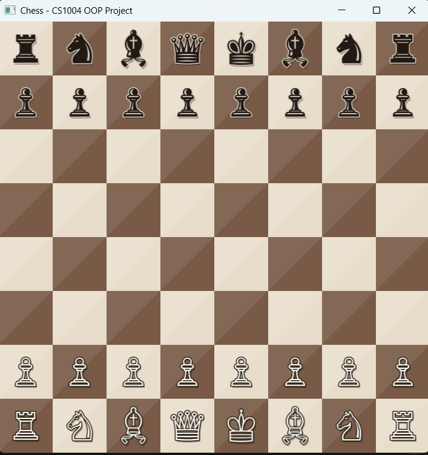
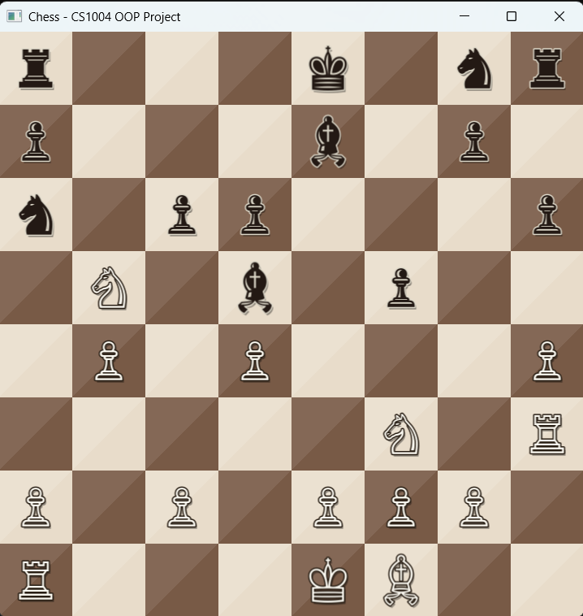
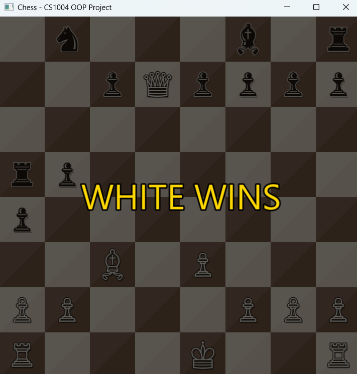

<div align="center">

# ♛ Marble Chess

### A two-player chess game built in modern C++ with SFML

**An object-oriented chess engine featuring a hand-crafted marble board, Unicode chess pieces with drop shadows, and gold selection highlights — built from the ground up to demonstrate the core principles of object-oriented programming.**

[](https://isocpp.org/)
[](https://www.sfml-dev.org/)
[](https://visualstudio.microsoft.com/)
[](LICENSE)

</div>

---

## 📋 Table of Contents

- [Overview](#-overview)
- [Features](#-features)
- [Screenshots](#-screenshots)
- [OOP Concepts Demonstrated](#-oop-concepts-demonstrated)
- [Project Architecture](#%EF%B8%8F-project-architecture)
- [Class Hierarchy](#-class-hierarchy)
- [Build & Run](#%EF%B8%8F-build--run)
- [How to Play](#-how-to-play)
- [Project Structure](#-project-structure)
- [Future Enhancements](#-future-enhancements)
- [Contributors](#-contributors)
- [Acknowledgments](#-acknowledgments)

---

## 🎯 Overview

**Marble Chess** is a fully-graphical two-player chess game implemented as a semester project for **CS1004 — Object Oriented Programming** at FAST National University.

Rather than relying on external chess libraries, every piece, rule, and visual element was built from scratch — the goal was not to make the world's best chess engine, but to demonstrate clean, idiomatic OOP design through a project everyone understands.

The result is a polished desktop application where two players can play classic chess on the same machine, with smooth mouse-based interaction and an aesthetic that resembles a real marble chessboard.

---

## ✨ Features

### Gameplay
- ♟️ Full implementation of standard piece movement (Pawn, Rook, Knight, Bishop, Queen, King)
- 🎯 Move validation — illegal moves are silently rejected
- 🚫 Path-blocking detection for sliding pieces (Rook, Bishop, Queen)
- 🛡️ Friendly-fire prevention — you cannot capture your own pieces
- 🏆 Win detection via King capture, with elegant overlay
- 🔄 Strict turn alternation (White → Black → White)

### Visuals
- 🎨 **Marble board** with cream and walnut squares, accented with subtle white-light shine
- ♛ **True chess pieces** rendered as Unicode glyphs from the system font (no image files needed)
- 💎 **Layered rendering** — every piece has a soft drop shadow and a contrasting outline for depth
- 🟡 **Gold selection ring** that highlights the chosen piece without disrupting the board's mood
- 🏁 **Cinematic winner overlay** — the screen dims and a large gold "WHITE/BLACK WINS" banner appears

### Code Quality
- 🏗️ Proper **modular 3-file structure** (one header + implementation per logical module)
- 🔒 Strict **encapsulation** with private data and public accessors
- 🌳 Clean **inheritance hierarchy** rooted at the abstract `Piece` class
- 🎭 Genuine **runtime polymorphism** via pure virtual functions
- 🧹 Proper **resource management** — every `new` has a matching `delete`

---

## 📸 Screenshots

> _Add your gameplay screenshots in a `screenshots/` folder and reference them here._

<div align="center">

| Initial Board | Mid-Game | Game Over |
|:-:|:-:|:-:|
|  |  |  |
| _All pieces in starting positions_ | _Selected piece highlighted in gold_ | _Cinematic winner overlay_ |

</div>

---

## 🧬 OOP Concepts Demonstrated

This project was designed to teach — and showcase — every major OOP concept covered in CS1004.

| Concept | Where It Lives | What It Looks Like |
|---|---|---|
| **Encapsulation** | `Piece.h` — protected state, public accessors | `getColor()`, `getRow()`, `setPosition()` |
| **Inheritance** | `Pawn`, `Rook`, `Knight`, `Bishop`, `Queen`, `King` all extend `Piece` | `class Knight : public Piece` |
| **Polymorphism** | `Game::handleClick()` calls `isValidMove()` without knowing the piece type | Runtime dispatch via virtual functions |
| **Pure Virtual Functions** | `Piece::isValidMove()` and `Piece::getSymbol()` are abstract | `= 0` makes `Piece` an abstract class |
| **Composition** | `Board` *has-a* 2D array of `Piece*`; `Game` *has-a* `Board` | Strong ownership semantics |
| **Constructors / Destructor** | Initialization lists, `virtual ~Piece()`, `~Board()` cleans up all allocations | Proper RAII |
| **`this` Pointer** | Used in `Piece` constructor to disambiguate parameters | `this->color = pieceColor;` |
| **Constant Member Functions** | All accessors marked `const` to enforce read-only contracts | `int getRow() const;` |
| **Dynamic Memory** | All 32 pieces allocated with `new`, freed in `Board::~Board()` | `new Pawn(WHITE, 6, c);` |
| **Static Member Functions** | `King::isKingPiece()` for type checking without an instance | Used in win detection |
| **Separation of Interface & Implementation** | Every class has its `.h` (declaration) paired with `.cpp` (definition) | Modular 3-file structure |
| **Header Guards** | Each header is wrapped in `#ifndef ... #endif` | Prevents double-inclusion errors |
| **`dynamic_cast`** | Used to identify a King at runtime | Demonstrates RTTI |

---

## 🏗️ Project Architecture

The codebase is split into three logical modules, each with its own header and implementation file:

```
┌──────────────────────────────────────────────────────────────┐
│                          main.cpp                            │
│                  (entry point — 13 lines)                    │
└────────────────────────────┬─────────────────────────────────┘
                             │ creates
                             ▼
┌──────────────────────────────────────────────────────────────┐
│                       Game (Game.cpp)                        │
│   • SFML window management                                   │
│   • Mouse input handling                                     │
│   • Drawing (board, pieces, overlays)                        │
│   • Turn management & win detection                          │
└────────────────────────────┬─────────────────────────────────┘
                             │ owns a
                             ▼
┌──────────────────────────────────────────────────────────────┐
│                      Board (Board.cpp)                       │
│   • 8×8 grid of Piece pointers                               │
│   • Piece setup and cleanup (RAII)                           │
│   • Move execution                                           │
└────────────────────────────┬─────────────────────────────────┘
                             │ contains
                             ▼
┌──────────────────────────────────────────────────────────────┐
│              Piece + 6 Derived (Piece.cpp)                   │
│   • Abstract Piece base class                                │
│   • Pawn, Rook, Knight, Bishop, Queen, King                  │
│   • Each defines its own movement rules via polymorphism     │
└──────────────────────────────────────────────────────────────┘
```

This layered architecture ensures **separation of concerns** — each module has one job and minimal dependencies. `Piece` knows nothing about graphics; `Game` knows nothing about how pawns move.

---

## 🌳 Class Hierarchy

```
                        ┌─────────────┐
                        │    Piece    │  (abstract)
                        │─────────────│
                        │ + color     │
                        │ + row, col  │
                        │ # isValidMove() = 0
                        │ # getSymbol() = 0
                        └──────┬──────┘
                               │
        ┌────────────┬─────────┼─────────┬────────────┬───────┐
        ▼            ▼         ▼         ▼            ▼       ▼
    ┌────────┐  ┌────────┐ ┌────────┐ ┌────────┐ ┌────────┐ ┌──────┐
    │  Pawn  │  │  Rook  │ │ Knight │ │ Bishop │ │ Queen  │ │ King │
    └────────┘  └────────┘ └────────┘ └────────┘ └────────┘ └──────┘
```

Every concrete piece overrides `isValidMove()` with its own movement rule, and `getSymbol()` to return its Unicode glyph. The runtime resolves the correct override automatically — that's polymorphism in action.

---

## 🛠️ Build & Run

### Prerequisites

- **Visual Studio 2022** (Community edition is fine)
- **SFML 3.0+** ([download here](https://www.sfml-dev.org/download/sfml/3.0.0/) — choose "Visual C++ 17 (2022) - 64-bit")
- **C++17** language standard
- **Windows 10/11** (Linux/macOS users see notes below)

### Setup Instructions (Windows)

<details>
<summary><b>Click to expand the full setup walkthrough</b></summary>

1. **Extract SFML** to `C:\SFML\SFML-3.0.0\` (or your preferred location)

2. **Clone this repository:**
   ```bash
   git clone https://github.com/<your-username>/Chess-CPP-SFML-OOP.git
   ```

3. **Create a new Empty C++ Project** in Visual Studio 2022, then add all `.h` and `.cpp` files via:
   _Right-click project → Add → Existing Item → select all 7 files_

4. **Switch the platform to x64** (top toolbar dropdown).

5. **Configure the project** — Right-click project → Properties:
   - **C/C++ → General → Additional Include Directories:** `C:\SFML\SFML-3.0.0\include`
   - **C/C++ → Language → C++ Language Standard:** `ISO C++17 Standard (/std:c++17)`
   - **Linker → General → Additional Library Directories:** `C:\SFML\SFML-3.0.0\lib`
   - **Linker → Input → Additional Dependencies (Debug):**
     ```
     sfml-graphics-d.lib
     sfml-window-d.lib
     sfml-system-d.lib
     ```
   - **Linker → Input → Additional Dependencies (Release):** _(remove the `-d`)_
     ```
     sfml-graphics.lib
     sfml-window.lib
     sfml-system.lib
     ```

6. **Build** the project (`Ctrl + Shift + B`).

7. **Copy the SFML DLLs** from `C:\SFML\SFML-3.0.0\bin\` into your project's `x64\Debug\` folder:
   - `sfml-graphics-d-3.dll`
   - `sfml-window-d-3.dll`
   - `sfml-system-d-3.dll`

8. **Run** with `Ctrl + F5`. Enjoy.

</details>

### Linux Build (Bonus)

```bash
sudo apt install libsfml-dev    # Make sure this gives you SFML 3+
g++ -std=c++17 main.cpp Piece.cpp Board.cpp Game.cpp \
    -o chess -lsfml-graphics -lsfml-window -lsfml-system
./chess
```

---

## 🎮 How to Play

1. **White moves first.** A turn indicator isn't necessary — there's only one set of pieces you can pick up at a time.
2. **Click any of your pieces.** A gold ring appears around it to confirm selection.
3. **Click the destination square.**
   - If the move is legal, the piece moves and it becomes your opponent's turn.
   - If the move is illegal, the selection clears and you can try again.
4. **Click the same square** to deselect a piece without moving it.
5. **Capture the opposing King** to win — a cinematic overlay announces the victor.

> 💡 **Tip:** Pawn captures are diagonal. Knights jump in an L-shape and ignore blockers. Bishops and Rooks slide; Queens combine both. Kings move only one square.

---

## 📁 Project Structure

```
Chess-CPP-SFML-OOP/
│
├── 📜 main.cpp           # Program entry point (13 lines)
│
├── 📜 Piece.h            # Piece base class + 6 derived classes (declarations)
├── 📜 Piece.cpp          # Piece implementations + helper functions
│
├── 📜 Board.h            # Board class declaration
├── 📜 Board.cpp          # Board class implementation
│
├── 📜 Game.h             # Game class declaration (window, drawing, input)
├── 📜 Game.cpp           # Game class implementation
│
├── 📁 screenshots/       # Gameplay screenshots for README
├── 📜 .gitignore         # Visual Studio + SFML build artifacts
├── 📜 LICENSE            # MIT License
└── 📜 README.md          # You are here!
```

**Total:** ~800 lines of clean, readable C++ — split into 7 focused files.

---

## 🚀 Future Enhancements

The current implementation focuses on demonstrating OOP fundamentals with a polished UX. Natural next steps would include:

- ♛ **Pawn promotion** — auto-promote pawns reaching the back rank to Queens
- ⚔️ **Check & Checkmate detection** — proper end-game logic instead of King capture
- 🏰 **Castling** — special King + Rook move
- 🎯 **En passant** — diagonal pawn capture rule
- ⏸️ **Stalemate & draw conditions** — fifty-move rule, threefold repetition
- 💾 **Save/load games** — serialize the board state to a file
- 🤖 **Single-player vs AI** — add a simple Minimax-based opponent
- 🎵 **Sound effects** — piece-move and capture audio
- 📜 **Move history panel** — algebraic notation log on the side

Each of these would build directly on the existing OOP foundation without restructuring the codebase.

---

## 👥 Contributors

This project was developed as a group effort for CS1004 at FAST-NU.

<div align="center">

| Name | Role | GitHub |
|:-:|:-:|:-:|
| _Your Name_ | _e.g., Lead Developer — Piece classes & game logic_ | [@your-username](https://github.com/your-username) |
| _Member 2_ | _e.g., Board class & rendering_ | [@member2-username](https://github.com/member2-username) |
| _Member 3_ | _e.g., Game class & input handling_ | [@member3-username](https://github.com/member3-username) |

</div>

> _Replace these with your actual group members and their respective contributions._

---

## 🙏 Acknowledgments

- **Instructor:** _Rizwan Ul Haq_ — for the project guidance and the CS1004 OOP curriculum
- **SFML team** — for the wonderfully simple multimedia library that made the graphics painless
- **Robert Lafore & Bjarne Stroustrup** — whose textbooks shaped the design choices throughout
- **The Unicode Consortium** — for blessing us with proper chess glyphs in the standard

---

<div align="center">

### ⭐ If you found this project helpful, please consider giving it a star!

**Built with ♥ at FAST National University — Faisalabad-Chiniot Campus**

</div>
